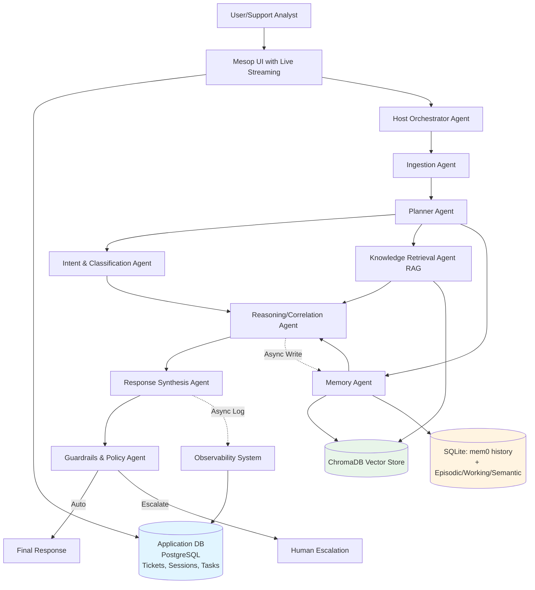

# Collaborative Support & Incident Co-Pilot System

## Architecture Overview



## Team Structure & Task Division (5 People, 1.5 Days)

### Day 1 Morning (4 hours) - Foundation Setup

#### Person 1: Infrastructure & Project Lead
**Core Infrastructure (3-4 hours)**
- Set up project structure based on [a2a-samples/samples/python/agents/airbnb_planner_multiagent](a2a-samples/samples/python/agents/airbnb_planner_multiagent)
- Create main project: `support_agents/`
- Set up `pyproject.toml` with dependencies:
  ```toml
  dependencies = [
      "a2a-sdk>=0.3.0",
      "google-adk>=1.7.0",
      "langchain>=0.3.0",
      "langchain-google-genai>=2.1.5",
      "langgraph>=0.4.5",
      "chromadb>=0.5.0",
      "sentence-transformers>=3.0.0",
      "pypdf2>=3.0.0",
      "python-docx>=1.1.0",
      "python-pptx>=1.0.0",
      "pillow>=10.0.0",
      "pytesseract>=0.3.10",
      "sqlalchemy>=2.0.0",
      "alembic>=1.13.0",
      "psycopg2-binary>=2.9.9",
  ]
  ```
- Set up `.env` template and document all API keys needed
- Create shared utilities: `utils/logging.py`, `utils/config.py`

**Application Database Setup (1 hour)** ✅ COMPLETED
- **Database Models** (`database/models.py`):
  - `User`: user_id, email, role, created_at
  - `Ticket`: ticket_id, user_id, title, description, status, priority, timestamps
  - `Session`: session_id, user_id, context_id, timestamps
  - `Task`: task_id, ticket_id, context_id, status, agent_name, input/output data
  - `AgentExecution`: execution_id, task_id, agent_name, tool_name, input/output, duration
  - `Metric`: metric_id, agent_name, metric_type, value, timestamp

- **Database Connection** (`database/connection.py`):
  - PostgreSQL connection with connection pooling
  - SQLAlchemy session management
  - Database initialization functions
  - Context manager for safe database access

- **Database Services** (`database/services.py`):
  - `TicketService`: CRUD operations for tickets
  - `TaskService`: Task tracking and state management
  - `ExecutionService`: Agent execution logging
  - `MetricService`: Observability metrics storage
  - `UserService`: User management
  - `SessionService`: Session management

- **Database Migrations** (`database/migrations/`):
  - Alembic setup for schema versioning
  - Initial migration script
  - Migration environment configuration

- **Docker Setup**:
  - `Dockerfile`: Application container with all dependencies
  - `docker-compose.yml`: PostgreSQL + Application setup
  - Health checks for PostgreSQL
  - Automatic database initialization on startup

- **Initialization Scripts**:
  - `scripts/init_db.py`: Application database initialization with seed data
  - Supports `--seed` flag for test data
  - Supports `--drop` flag for clean reset

- Initialize database: `python scripts/init_db.py --seed`
- Test database operations with sample data

- Coordinate integration points between team members

#### Person 2: RAG System & Document Processing
**RAG Pipeline (4 hours)**
Reference: [a2a-samples/samples/python/agents/a2a_mcp/src/a2a_mcp/mcp/server.py](a2a-samples/samples/python/agents/a2a_mcp/src/a2a_mcp/mcp/server.py)

Create `agents/rag_agent/`:
- **Document Ingestion Pipeline** (`document_processor.py`):
  - PDF parser with image extraction (PyPDF2 + pytesseract for OCR)
  - Word/DOCX parser (python-docx)
  - PowerPoint parser (python-pptx)
  - Text file parser
  - Image parser with OCR (Pillow + pytesseract)
  - **Chunking Strategy**: 512 tokens with 128 token overlap
  - Justification document for chunking parameters

- **Vector Store Setup** (`vector_store.py`):
  - ChromaDB initialization
  - Embedding model: `sentence-transformers/all-mpnet-base-v2`
  - Collection: "support_documents"
  - Metadata: doc_type, file_name, page_number, created_date

- **RAG Agent** (`rag_agent.py`):
  - Google ADK LlmAgent with retrieval tool
  - Search top-k=5 relevant chunks
  - Reference retrieved context in responses
  - MCP server for retrieval tool (`rag_mcp.py`)

- **Test Dataset Generation Script** (`generate_test_docs.py`):
  - Generate 100 synthetic support documents (5-6 pages each)
  - Topics: Payment failures, API errors, Dashboard issues, Auth problems, Network timeouts
  - Mix of PDF, DOCX, TXT, PPTX with embedded images
  - Use templates + LLM to generate realistic content

#### Person 3: Memory System & Guardrails
**Memory Agent (2 hours)** ✅ COMPLETED
Reference: [a2a-samples/samples/python/agents/crewai/in_memory_cache.py](a2a-samples/samples/python/agents/crewai/in_memory_cache.py)

Create `agents/memory_agent/`:
- **Memory Database** (`memory_db.py`): ✅ COMPLETED
  - SQLite with SQLAlchemy ORM
  - Separate database from application DB (as per requirements)
  - Tables: `WorkingMemory`, `EpisodicMemory`, `SemanticMemory`
  - Schemas:
    - Working: session_id, context_id, task_data, timestamp, expires_at
    - Episodic: incident_id, query_text, resolution, outcome, tags, timestamp
    - Semantic: doc_id, content_hash, embedding_id, category, last_accessed, access_count

- **Memory Schema** (`memory_schema.py`): ✅ COMPLETED
  - SQLAlchemy models for all three memory types
  - Proper indexes for performance

- **Initialization Script** (`agents/memory_agent/scripts/init_memory_db.py`): ✅ COMPLETED
  - Database initialization script
  - Supports `--drop` flag for clean reset

- **Memory Agent** (`memory_agent.py`):
  - LangGraph agent for memory operations
  - Tools: `read_memory`, `write_memory`, `search_memory`, `delete_memory`
  - Async writes to avoid blocking
  - Context windowing (last 10 turns)

- **UI for Memory Management** (coordinate with Person 5):
  - View/Edit/Delete interface in Mesop UI

**Guardrails Agent (2 hours)**
Create `agents/guardrails_agent/`:
- **Content Safety** (`guardrails_agent.py`):
  - Google ADK agent with safety tools
  - Use Google's Perspective API or llama-guard
  - Categories: Violence, Self-Harm, Sexual, Hate Speech, Jailbreak
  - Pattern detection (not hardcoded examples)
  - Confidence threshold: 0.7 for auto-response, <0.7 escalates
  - Hallucination detection: check if response references retrieved context
  - Escalation policy: log to database, notify, human handoff

#### Person 4: Core Support Agents (Ingestion, Intent, Reasoning)
**Ingestion Agent (1 hour)**
Create `agents/ingestion_agent/`:
- `ingestion_agent.py`: ADK agent
- Normalize tickets/queries/chats
- Extract: priority, customer_id, error_codes, timestamps
- Output structured JSON
- **Use database services**: Create ticket via `TicketService.create_ticket()`

**Intent & Classification Agent (1.5 hours)**
Create `agents/intent_agent/`:
- `intent_agent.py`: LangGraph agent
- Classify: incident_type, urgency (P0-P4), SLA_risk
- Categories: Payment, API, Dashboard, Auth, Network, Other
- Use structured output with Pydantic models
- **Update ticket**: Use `TicketService.update_ticket_status()` to set priority

**Reasoning/Correlation Agent (1.5 hours)**
Create `agents/reasoning_agent/`:
- `reasoning_agent.py`: ADK agent
- Takes inputs from Intent, RAG, Memory agents
- Correlate current issue with historical incidents
- Pattern detection: similar error codes, affected regions
- Root cause analysis suggestions
- Output: analysis, similar_incidents, recommended_actions
- **Log execution**: Use `ExecutionService.log_execution()` for observability

#### Person 5: UI & Observability
**Extend Mesop Demo UI (4 hours)**
Reference: [a2a-samples/demo/ui](a2a-samples/demo/ui)

Customize for support use case:
- **Main Chat Interface** (`pages/support_chat.py`):
  - Ticket input form (title, description, priority)
  - Live streaming agent execution steps
  - Progress indicators for each agent
  - Tool call visualization
  - **Display tickets from database**: Query `TicketService.list_tickets()`

- **Agent Execution Viewer** (`components/agent_viewer.py`):
  - Real-time agent call display
  - Input/output for each tool
  - Inter-agent communication flow
  - Timeline visualization
  - **Query execution logs**: Use `ExecutionService.get_executions_by_task()`

- **Memory Management UI** (`pages/memory_manager.py`):
  - View episodic memory
  - Edit/delete entries
  - Search historical incidents
  - **Query memory database**: Direct access to Memory Agent's SQLite DB

- **Observability Dashboard** (`pages/observability.py`):
  - Agent execution metrics
  - Response times per agent
  - Success/failure rates
  - Escalation statistics
  - **Query metrics**: Use `MetricService.get_metrics()` from application DB

### Day 1 Afternoon (4 hours) - Agent Implementation

#### Person 1: Host Orchestrator & Planner
**Host Orchestrator Agent**
Reference: [a2a-samples/samples/python/hosts/a2a_multiagent_host/routing_agent.py](a2a-samples/samples/python/hosts/a2a_multiagent_host/routing_agent.py)

Create `agents/host_agent/`:
- `host_agent.py`: ADK agent
- Discovers all 8 specialist agents via A2A
- Routes initial request to Ingestion → Planner
- Handles final response aggregation
- **Create tasks**: Use `TaskService.create_task()` for tracking

**Planner Agent**
Create `agents/planner_agent/`:
- `planner_agent.py`: LangGraph agent with StateGraph
- Decision logic:
  - **Serial**: Ingestion → Intent → (RAG || Memory) → Reasoning → Response → Guardrails
  - **Parallel**: RAG + Memory queries simultaneously
  - **Async**: Memory writes, observability logging to database
- Execution plan output: agent_sequence, parallel_groups, async_tasks
- **Update task status**: Use `TaskService.update_task_status()` throughout execution

#### Person 2: Complete RAG Agent Testing
- Index generated 100 test documents
- Test retrieval quality
- Benchmark retrieval latency
- Document retrieval metrics
- **Log metrics**: Use `MetricService.record_metric()` for RAG performance

#### Person 3: Response Synthesis Agent
Create `agents/response_agent/`:
- `response_agent.py`: ADK agent
- Takes reasoning output + retrieved context
- Generates human-readable markdown response
- Includes: summary, details, next_steps, confidence_score
- References sources from RAG
- **Update task output**: Use `TaskService.update_task_status()` with output_data

#### Person 4: Agent A2A Server Setup
For all 8 agents, create A2A server wrappers:
- `agents/*/agent_executor.py`: A2A executor (similar to [weather_executor.py](a2a-samples/samples/python/agents/airbnb_planner_multiagent/weather_agent/weather_executor.py))
- `agents/*/__main__.py`: A2A server setup
- Unique ports: 10001-10008
- AgentCard definitions with skills/descriptions
- **Log executions**: Each agent executor should log to `ExecutionService` for observability

#### Person 5: UI Integration
- Integrate all agent endpoints
- Test live streaming
- Add error handling
- Style improvements
- **Connect to database**: Query tickets, tasks, executions for display

### Day 2 Morning (3 hours) - Integration & Testing

#### Person 1 & 4: End-to-End Integration
- Start all 8 A2A agent servers
- Start Host orchestrator
- **Verify database connections**:
  - Application DB initialized and accessible
  - Memory DB initialized and accessible
  - Vector DB initialized and accessible
- **Test database operations**:
  - Create test ticket → verify in DB
  - Execute agent → verify execution logged
  - Check memory persistence across requests
- Test complete flow with scenarios:
  1. "Payment service failing intermittently for EU users"
  2. "Have we seen error code 504 before?"
  3. "Why is my dashboard not loading?"
- **Verify observability**: Check that all agent executions are logged to database

#### Person 2 & 3: Testing & QA
**Testing Framework** (`tests/`):
- Unit tests for each agent
- Integration tests for agent chains
- **Database Tests** (`test_database.py`): ✅ COMPLETED
  - Test ticket CRUD operations
  - Test task state persistence
  - Test agent execution logging
  - Test memory persistence across sessions
- RAG retrieval quality tests (precision@k, recall@k)
- Memory persistence tests
- Guardrails effectiveness tests
- Load testing (concurrent requests)
- Long conversation tests (20+ turns)

**Quality Metrics**:
- Response accuracy
- Retrieval relevance
- Agent latency (target: <5s end-to-end)
- Memory recall accuracy
- **Database Performance**: Query times, connection pool efficiency

#### Person 5: Observability & Monitoring
**Monitoring System** (`monitoring/`):
- Agent execution tracing
- Performance metrics collection
- Error rate tracking
- Grafana-style dashboard in UI
- Export capabilities (JSON logs)
- **Query from database**: Use `MetricService` and `ExecutionService` for metrics

### Day 2 Afternoon (3 hours) - Polish & Documentation

#### All Team: Final Polish
- **Person 1**: README, architecture diagrams, deployment guide, database documentation
- **Person 2**: RAG documentation, chunking justification, test results
- **Person 3**: Memory system docs, guardrails policy document
- **Person 4**: Agent API documentation, testing report
- **Person 5**: UI walkthrough, demo script, video recording

**Production-Grade Code**:
- Consistent folder structure
- Type hints everywhere
- Docstrings for all functions
- Error handling with proper logging
- Configuration via environment variables
- Docker setup ✅ COMPLETED

## Key Technical Decisions

### Agent Framework Mix
- **Google ADK**: Ingestion, RAG, Reasoning, Response (leverage A2A samples)
- **LangGraph**: Planner, Intent, Memory (complex workflows, state management)
- **Hybrid**: Host uses ADK for A2A coordination

### Execution Models
**Serial Execution**: Ingestion → Planner → Intent  
**Parallel Execution**: RAG query + Memory search simultaneously  
**Asynchronous**: Memory writes after Reasoning, Observability logging throughout

### RAG Configuration
- **Chunk Size**: 512 tokens (balance between context and precision)
- **Overlap**: 128 tokens (25% overlap for semantic continuity)
- **Embedding Model**: all-mpnet-base-v2 (384 dimensions, good quality/speed)
- **Vector DB**: ChromaDB (local, fast setup, good for hackathon)
- **Retrieval**: top-k=5, then rerank by relevance

### Memory Strategy
- **Working Memory**: Redis-like in-memory cache with TTL (session duration)
- **Episodic Memory**: SQLite persistent storage ✅ COMPLETED
- **Semantic Memory**: ChromaDB (same as RAG documents)
- **Context Window**: Last 10 conversation turns, summarize older context

### Database Architecture ✅ COMPLETED
**Three Separate Databases**:

1. **Application Database (PostgreSQL)**:
   - Purpose: Core application data (tickets, sessions, tasks, metrics)
   - Technology: PostgreSQL (production-ready)
   - Location: PostgreSQL container (docker-compose) or local PostgreSQL
   - Connection: `DATABASE_URL` environment variable
   - Managed by: `database/` module with SQLAlchemy ORM
   - Tables: Users, Tickets, Sessions, Tasks, AgentExecutions, Metrics

2. **Memory Database (SQLite)**:
   - Purpose: Memory Agent's three memory types (Episodic, Working, Semantic)
   - Technology: SQLite with SQLAlchemy
   - Location: `data/memory.db` (local file)
   - Connection: `MEMORY_DB_PATH` environment variable
   - Managed by: `agents/memory_agent/memory_db.py`
   - Tables: EpisodicMemory, WorkingMemory, SemanticMemory

3. **Vector Database (ChromaDB)**:
   - Purpose: Document embeddings for RAG retrieval
   - Technology: ChromaDB
   - Location: `data/vector_db/` (directory)
   - Managed by: `agents/rag_agent/vector_store.py` (to be created)

**Why Separate Databases?**
- **Separation of Concerns**: Memory Agent's data is domain-specific
- **Performance**: Different access patterns (relational vs vector search)
- **Scalability**: Can scale independently
- **Maintainability**: Clear boundaries between components

### Guardrails Policy
1. **Safety Check**: Before response generation
2. **Confidence Check**: Response must reference retrieved docs
3. **Escalation Criteria**: 
   - Safety violation detected
   - Confidence < 0.7
   - Query outside knowledge base
   - Complex multi-system issue
4. **Human Handoff**: Log incident to database, notify ops team, provide context

## File Structure

```
support_agents/
├── agents/
│   ├── host_agent/
│   │   ├── __init__.py
│   │   ├── __main__.py (port 8083)
│   │   ├── host_agent.py
│   │   └── agent_executor.py
│   ├── ingestion_agent/ (port 10001)
│   ├── planner_agent/ (port 10002)
│   ├── intent_agent/ (port 10003)
│   ├── rag_agent/ (port 10012)
│   │   ├── rag_agent.py
│   │   ├── rag_mcp.py
│   │   ├── document_processor.py
│   │   └── vector_store.py
│   ├── memory_agent/ (port 10005)
│   │   ├── memory_agent.py
│   │   ├── memory_db.py ✅ COMPLETED
│   │   ├── memory_schema.py ✅ COMPLETED
│   │   └── scripts/
│   │       └── init_memory_db.py ✅ COMPLETED
│   ├── reasoning_agent/ (port 10014)
│   ├── response_agent/ (port 10007)
│   └── guardrails_agent/ (port 10008)
├── database/ ✅ COMPLETED
│   ├── __init__.py
│   ├── models.py ✅ SQLAlchemy models (User, Ticket, Session, Task, AgentExecution, Metric)
│   ├── connection.py ✅ PostgreSQL connection management
│   ├── schema.py ✅ Schema utilities
│   ├── services.py ✅ Service layer (TicketService, TaskService, ExecutionService, etc.)
│   └── migrations/ ✅ Alembic migrations
│       ├── alembic.ini
│       ├── env.py
│       ├── script.py.mako
│       └── versions/
│           └── 001_initial_schema.py ✅ Initial migration
├── ui/
│   ├── main.py
│   ├── pages/
│   │   ├── support_chat.py
│   │   ├── memory_manager.py
│   │   └── observability.py
│   └── components/
│       ├── agent_viewer.py
│       ├── chat_bubble.py
│       └── ticket_form.py
├── utils/
│   ├── logging.py
│   ├── config.py
│   └── metrics.py
├── tests/
│   ├── test_agents.py
│   ├── test_rag.py
│   ├── test_memory.py
│   ├── test_database.py ✅ COMPLETED
│   └── test_integration.py
├── data/
│   ├── test_documents/ (100 generated files)
│   ├── vector_db/ (ChromaDB storage)
│   ├── memory.db (SQLite - Memory Agent only) ✅ COMPLETED
│   └── application.db (PostgreSQL via Docker) ✅ COMPLETED
├── monitoring/
│   ├── metrics_collector.py
│   └── dashboard.py
├── scripts/
│   ├── generate_test_docs.py
│   ├── init_db.py ✅ COMPLETED (Application DB initialization)
│   ├── start_all_agents.sh ✅ COMPLETED
│   └── run_tests.sh
├── docker-compose.yml ✅ COMPLETED
├── Dockerfile ✅ COMPLETED
├── pyproject.toml ✅ COMPLETED
├── README.md ✅ COMPLETED
├── DATABASE_SETUP.md ✅ COMPLETED
├── SETUP_COMPLETE.md ✅ COMPLETED
└── .env.example ✅ COMPLETED
```

## Critical Success Factors

### Must Have (Mandatory)
1. ✅ RAG with 100+ multimodal documents, proper chunking
2. ✅ Three memory types (Working, Episodic, Semantic) with read/write ✅ COMPLETED
3. ✅ Guardrails for safety + confidence thresholds
4. ✅ Planning agent with serial/parallel/async execution
5. ✅ 8 separate agent files, each with A2A integration
6. ✅ Observable tool calls (logged inputs/outputs) ✅ COMPLETED (via ExecutionService)
7. ✅ Live streaming UI showing agent execution
8. ✅ Inter-agent communication displayed in UI
9. ✅ Long conversation support (context management)
10. ✅ Application database for tickets, sessions, tasks ✅ COMPLETED

### Should Have (Important)
- Memory persistence UI (view/edit/delete)
- Production folder structure ✅ COMPLETED
- Comprehensive testing ✅ Database tests completed
- Monitoring dashboard
- Demo scenarios working end-to-end
- Docker deployment ✅ COMPLETED

### Nice to Have (Time Permitting)
- Performance benchmarks
- Video demo
- Advanced visualizations

## Risk Mitigation

**If Behind Schedule**:
- Day 1 End: Should have 6/8 agents working individually
- Day 2 Morning: Must have end-to-end flow working
- Priority agents: Planner, RAG, Guardrails (core value)
- Can simplify: Response Synthesis (just concatenate), Ingestion (minimal normalization)

**Common Issues**:
- A2A port conflicts: Use port range 10001-10008
- Vector DB slow: Reduce chunk count to 50 files for demo
- Memory not persisting: Check SQLite file permissions ✅ Database setup completed
- **Database connection errors**: Ensure PostgreSQL is running, check DATABASE_URL ✅ Setup scripts provided
- **Database schema not initialized**: Run `python scripts/init_db.py --seed` ✅ Scripts provided
- UI not streaming: Ensure async/await in event handlers
- Agent timeout: Increase A2A client timeout to 60s
- **Database migration failures**: Reset with `alembic downgrade base && alembic upgrade head` ✅ Migrations setup completed

## Demo Script

1. **Show Architecture**: Explain 8 agents and their roles
2. **Show Database Setup**: Demonstrate PostgreSQL + SQLite + ChromaDB architecture
3. **Ticket Submission**: "Payment failing for EU users" 
4. **Live Execution**: Show each agent executing in real-time
5. **Database Logging**: Show executions logged in database
6. **Results Display**: Show retrieved docs, memory recall, final response
7. **Memory Management**: Add manual note, show it appears in later query
8. **Guardrails Demo**: Try unsafe input, show escalation
9. **Observability**: Show metrics dashboard with database queries
10. **Long Conversation**: Multi-turn interaction showing context retention

## Reference A2A Samples Used

- **Multi-agent orchestration**: [airbnb_planner_multiagent](a2a-samples/samples/python/agents/airbnb_planner_multiagent)
- **Host routing**: [a2a_multiagent_host/routing_agent.py](a2a-samples/samples/python/hosts/a2a_multiagent_host/routing_agent.py)
- **UI streaming**: [demo/ui](a2a-samples/demo/ui)
- **LangGraph agent**: [langgraph/app/agent.py](a2a-samples/samples/python/agents/langgraph/app/agent.py)
- **Memory**: [crewai/in_memory_cache.py](a2a-samples/samples/python/agents/crewai/in_memory_cache.py)
- **Embedding search**: [a2a_mcp/mcp/server.py](a2a-samples/samples/python/agents/a2a_mcp/src/a2a_mcp/mcp/server.py)

## Database Initialization

**Setup Script** (`scripts/init_db.py`): ✅ COMPLETED
```bash
# Initialize application database
python scripts/init_db.py --seed

# Initialize memory database (separate script)
python agents/memory_agent/scripts/init_memory_db.py
```

**Docker Setup**: ✅ COMPLETED
```bash
# Start everything (PostgreSQL + Application)
docker-compose up --build

# Database will be automatically initialized
```

## Expected Outcome

A production-grade multi-agent support system demonstrating:
- Clear agent boundaries with specialized roles
- Intelligent coordination via Planner
- Strong RAG over diverse document types
- Persistent memory across sessions ✅ Database setup completed
- Safety guardrails with confidence-based escalation
- Real-time observable execution ✅ Database logging completed
- Professional codebase ready for presentation ✅ Structure completed
- **Complete database architecture** ✅ PostgreSQL + SQLite + ChromaDB

## Progress Tracking

### ✅ Completed
- Project structure and file organization
- Application database (PostgreSQL) with models, services, migrations
- Memory database (SQLite) with schema and initialization
- Docker setup with docker-compose
- Database initialization scripts
- Database tests
- Documentation (README, DATABASE_SETUP.md, SETUP_COMPLETE.md)

### ⏳ In Progress
- Agent implementations (next phase)
- RAG pipeline (next phase)
- UI development (next phase)

### 📋 Pending
- All agent implementations
- RAG document processing
- UI components
- Integration and testing
- Final documentation
