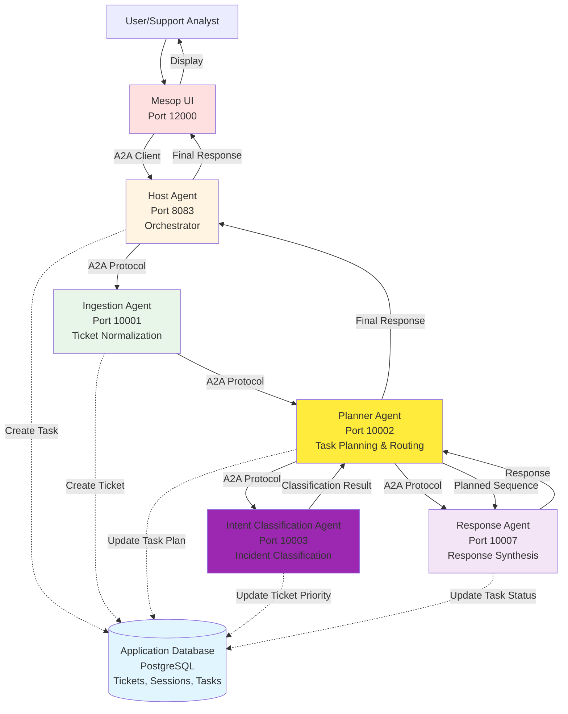

# Planner and Intent Classification Agent Implementation Plan

## Updated Architecture Overview



## Updated Flow

1. **User submits ticket** via Mesop UI (port 12000)
2. **UI sends request** to Host Agent (port 8083) via A2A client
3. **Host Agent orchestrates** the flow:
   - Routes to **Ingestion Agent** (port 10001) for ticket normalization
   - Ingestion Agent creates ticket in PostgreSQL database
   - Routes to **Planner Agent** (port 10002) for task planning
4. **Planner Agent** creates execution plan:
   - Determines which agents need to be invoked
   - Routes to **Intent Classification Agent** (port 10003) for classification
   - Intent Agent classifies incident type, urgency, and updates ticket priority
   - Routes to **Response Agent** (port 10007) for response generation
5. **Response flows back** through Planner → Host → UI
6. **UI displays** the final response to the user

## Implementation Details

### Planner Agent (Port 10002)

**Purpose**: Creates execution plans and routes tasks to appropriate agents based on ticket content.

**Responsibilities**:
- Analyze normalized ticket information from Ingestion Agent
- Determine which agents need to be invoked (Intent, RAG, Memory, Reasoning, Response)
- Create execution sequence (serial/parallel/async)
- Route tasks to appropriate agents
- Aggregate responses from multiple agents

**Implementation**:
- **Framework**: Google ADK (LlmAgent)
- **Model**: gemini-2.5-flash
- **Tools**: 
  - `send_message` - Route to remote agents
  - `create_execution_plan` - Generate structured plan
- **Database Integration**: 
  - Update task with execution plan
  - Log planning decisions

**Files**:
- `agents/planner_agent/planner_agent.py` - ADK agent with planning logic
- `agents/planner_agent/planner_executor.py` - A2A executor
- `agents/planner_agent/__main__.py` - A2A server entry point

### Intent Classification Agent (Port 10003)

**Purpose**: Classifies support tickets by incident type, urgency, and SLA risk.

**Responsibilities**:
- Classify incident type: Payment, API, Dashboard, Auth, Network, Other
- Determine urgency level: P0 (critical), P1 (high), P2 (medium), P3 (low), P4 (lowest)
- Assess SLA risk based on ticket content
- Update ticket priority in database

**Implementation**:
- **Framework**: Google ADK (LlmAgent)
- **Model**: gemini-2.5-flash
- **Structured Output**: Pydantic models for classification results
- **Database Integration**: 
  - Update ticket priority via `TicketService.update_ticket_priority()`
  - Log classification results

**Classification Categories**:
- **Incident Types**: Payment, API, Dashboard, Auth, Network, Other
- **Urgency Levels**: P0 (critical), P1 (high), P2 (medium), P3 (low), P4 (lowest)
- **SLA Risk**: High, Medium, Low

**Files**:
- `agents/intent_agent/intent_agent.py` - ADK agent with classification logic
- `agents/intent_agent/intent_executor.py` - A2A executor
- `agents/intent_agent/__main__.py` - A2A server entry point

## Database Integration

### Planner Agent
- **Task Updates**: Store execution plan in task metadata
- **Planning Logs**: Record planning decisions for observability

### Intent Classification Agent
- **Ticket Updates**: Update ticket priority based on classification
- **Classification Logs**: Store classification results for analysis

## Environment Variables

Add to `.env`:
```bash
PLANNER_AGENT_URL=http://localhost:10002
INTENT_AGENT_URL=http://localhost:10003
```

## Testing

### Test Planner Agent
1. Send normalized ticket from Ingestion Agent
2. Verify execution plan is created
3. Verify routing to Intent Agent
4. Verify routing to Response Agent
5. Check database for plan metadata

### Test Intent Classification Agent
1. Send ticket information
2. Verify classification (incident_type, urgency, SLA_risk)
3. Verify ticket priority updated in database
4. Test all classification categories

## Success Criteria

- ✅ Planner Agent starts on port 10002
- ✅ Intent Classification Agent starts on port 10003
- ✅ Planner Agent creates execution plans
- ✅ Planner Agent routes to Intent Agent
- ✅ Intent Agent classifies tickets correctly
- ✅ Intent Agent updates ticket priority in database
- ✅ Planner Agent routes to Response Agent
- ✅ End-to-end flow: UI → Host → Ingestion → Planner → Intent → Response → UI
- ✅ Database shows updated ticket priority and execution plan
